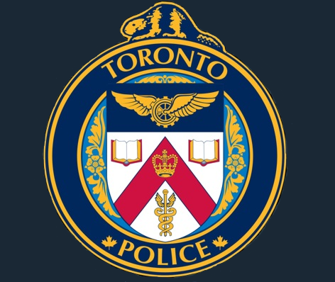
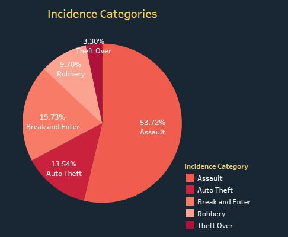
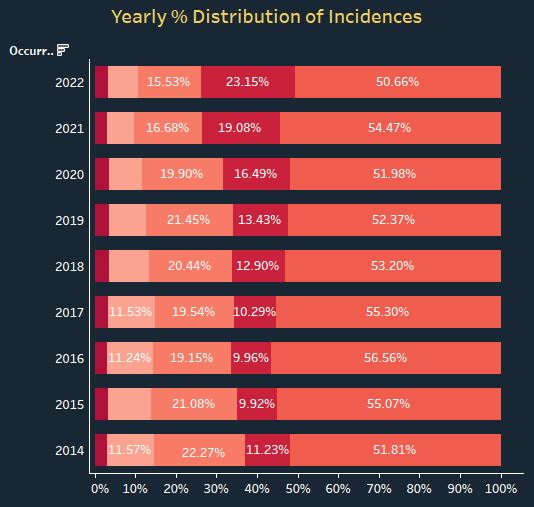
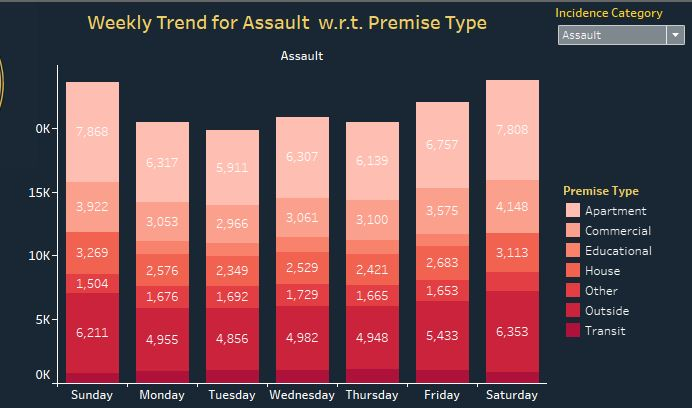
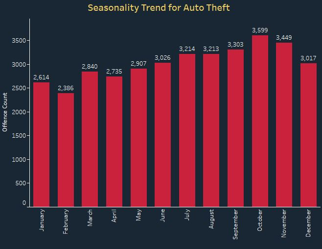
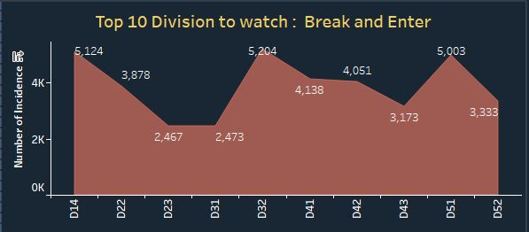
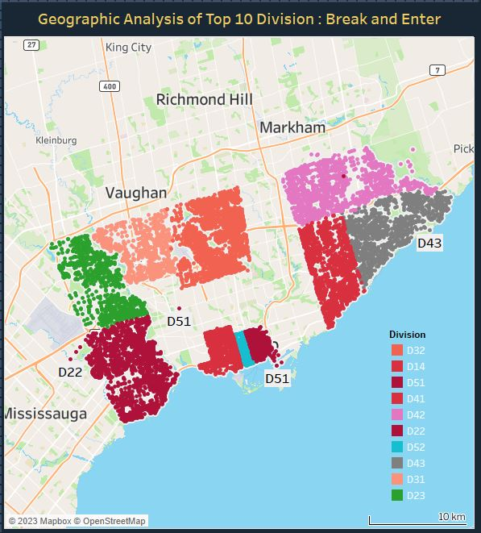

# Major Crime Indicators in Toronto using Tableau

 

You can view my Interactive Tableau Dashboard  <a href="https://public.tableau.com/app/profile/varsha.agarwal127/viz/Major_crime_indicator/major_crime_indicators"> here</a>

## Introduction

The <b>Major Crime Indicators </b> dataset is a <i>real time data</i> that provides information about the number of incidents for different categories of crimes reported by the <b>Toronto Police Service</b>. The dataset can be accessed from <a href="https://open.toronto.ca/">here</a>. The dataset contains information such as the occurrence date and time, division, category, and location of the incident. In this project, I created an interactive <b>Tableau visualization dashboard</b> to analyze the data and draw insights.
	My analysis involve cleaning and processing the data, followed by utilizing Tableau to perform advanced analysis and generate valuable insights.

## Key Features

1.Identify the total number of incident categories and their percentage distribution. The highest incident categories are assault, break and enter, and auto theft.
2. Show the yearly percentage distribution of these incidents from 2014 to 2022. One of the most notable findings is the steady increase in the percentage of auto theft incidents, even during the COVID-19 pandemic.
3. Display the weekly trend for all categories, showing different patterns. For instance, assault is highest on weekends, auto theft is high on weekdays, and its subcategory "premises type" indicates that most thefts happen in outside areas such as parking lots or outside of malls.
4. Show the seasonal bar trend, which demonstrates monthly patterns over the year. Assault and auto theft rise steeply as summer approaches, while other categories show a smaller increase.
5. Provide a geographical street graph that highlights the top 10 divisions and their rankings. Toronto's downtown area, including Division 51, consistently has the highest crime rates across all categories.

## Findings
•	The top three incident categories are assault (24.7%), break and enter (22.7%), and auto theft (18.7%).

Figure: Flow Chart
•	Auto theft shows a steady increase in percentage from 2014 (16.4%) to 2022 (22.9%), even during the COVID-19 pandemic. 

Figure: Flow Chart
•	Assault is highest on weekends, while auto theft is high on weekdays. Its subcategory "premises type" indicates that most thefts happen in outside areas such as parking lots or outside of malls.

Figure: Flow Chart
•	Assault and auto theft rise steeply as summer approaches, while other categories show a smaller increase.

Figure: Flow Chart
•	Toronto's downtown area, including Division 51, consistently has the highest crime rates across all categories. Other divisions in Toronto and Mississauga also show high crime rates. 

Figure: Flow Chart

## Conclusion

By analyzing major crime indicators in Toronto, this project provides valuable insights that can help law enforcement agencies better understand crime patterns and take proactive measures to prevent crime. Through this project, I applied my analytical and data visualization skills to analyze real-world data and draw valuable insights. Check out my Tableau visualization dashboard and provide your feedback. Thank you for your support

